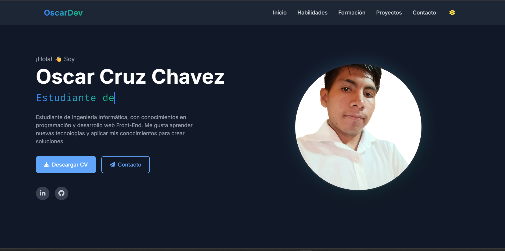

# Portafolio Web - Oscar Cruz Chavez

¡Bienvenido a mi portafolio profesional! 🚀

Este proyecto es una muestra de mi trabajo como **Desarrollador Web Front-End**. Aquí encontrarás información sobre mis habilidades, proyectos destacados, formación y formas de contacto.

---

## 📸 Vista Previa




---

## 🛠️ Tecnologías Utilizadas

-  **HTML5**
-  **CSS3**
-  **JavaScript**
-  **Tailwind CSS**
-  **Astro**

---

## 🌟 Características

- Diseño moderno, responsivo y accesible
- Modo oscuro y claro
- Animaciones y transiciones suaves
- Sección de proyectos destacados
- Formulario de contacto funcional

---

## 📂 Estructura del Proyecto

```
portafolio/
  ├── assets/
  │   ├── images/
  │   ├── fonts/
  │   └── stylesheet/
  ├── index.html
  ├── script.js
  └── README.md
```

---

## 🌐 Enlace al Sitio Web

[🔗 Ver Portafolio Online](https://mariana-am-portafolio.netlify.app/)

---

## 📬 Contacto

- [LinkedIn](https://www.linkedin.com/in/oscar-ch-521863340/)
- [GitHub](https://github.com/OSCARCH2002)

---

> © 2023 Oscar Cruz Chavez. Todos los derechos reservados.
